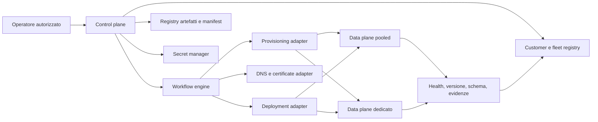
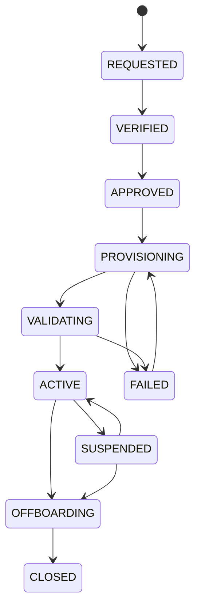
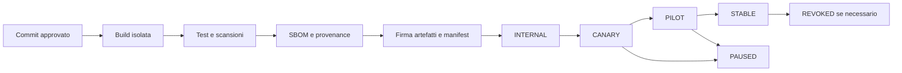

# Onboarding clienti, branding, provisioning e release

## Stato e limiti

Questo documento definisce l'architettura target dello Step 35. Non implementa onboarding SaaS, multi-tenancy, white-label, billing, provisioning automatico o aggiornamenti remoti.

Il gestionale attuale resta una singola installazione. Nessuna schermata o documentazione commerciale deve presentare le funzioni descritte come disponibili.

La proposta dipende da:

- ADR 0005 per tenant, aziende, sedi, magazzini e isolamento;
- ADR 0006 per privacy, retention, legal hold e offboarding;
- ADR 0007 per lifecycle cliente e flotta release.

## Riferimenti tecnici

Fonti consultate il 2026-07-25:

- NIST Secure Software Development Framework: https://csrc.nist.gov/pubs/sp/800/218/final
- Semantic Versioning 2.0.0: https://semver.org/
- SLSA 1.2: https://slsa.dev/spec/v1.2/
- CycloneDX specification: https://cyclonedx.org/specification/overview/
- Flyway migrations: https://documentation.red-gate.com/flyway/flyway-concepts/migrations

Versioni, strumenti e requisiti devono essere rivalutati prima di ogni implementazione o rilascio.

## Obiettivi

- attivare un cliente senza passaggi manuali non tracciati;
- impedire tenant parziali o risorse orfane;
- applicare un branding controllato senza introdurre codice cliente;
- mantenere un unico prodotto e un unico artefatto per release;
- conoscere versione, schema e stato di ogni installazione;
- aggiornare per coorti con promozione, pausa e rollback;
- gestire sospensione e offboarding senza perdere dati o evidenze;
- rendere ogni operazione riprendibile, idempotente e auditable.

## Principi non negoziabili

1. Il contratto commerciale non viene dedotto da una configurazione tecnica.
2. Il control plane non e il data plane del gestionale.
3. Nessun `tenant_id` arriva da un form operativo come fonte autorevole.
4. Nessun fork applicativo viene creato per cliente.
5. Nessun segreto viene memorizzato nel database del control plane in chiaro.
6. Nessun asset cliente puo eseguire codice.
7. Nessuna release viene ricostruita durante la promozione.
8. Nessuna migrazione applicata viene modificata.
9. Nessun contract database distruttivo precede l'adozione della flotta.
10. Nessun offboarding cancella dati prima delle verifiche di retention e legal hold.

## Terminologia

| Termine | Significato |
| --- | --- |
| Customer account | Relazione commerciale e di supporto con il cliente. |
| Tenant | Confine contrattuale e di sicurezza definito da ADR 0005. |
| Installation | Data plane che esegue una versione del gestionale. |
| Pooled | Tenant ospitato su infrastruttura e database condivisi con isolamento multilivello. |
| Dedicated | Deployment e database dedicati, con lo stesso modello logico. |
| Brand profile | Configurazione visuale e testuale versionata del tenant. |
| Entitlement | Modulo acquistato o abilitato per il tenant. |
| Feature flag | Controllo tecnico temporaneo per rollout o sperimentazione. |
| Release | Insieme immutabile e verificabile di artefatti, manifest e migrazioni. |
| Cohort | Gruppo di installazioni aggiornato nello stesso stadio. |

Customer account, tenant, legal entity, installation e subscription non sono sinonimi.

## Control plane e data plane



Il control plane conserva metadati operativi e riferimenti. Non legge ordini, pagamenti, anagrafiche o documenti del cliente.

Il data plane:

- valida il contesto tenant;
- applica autorizzazioni e regole business;
- espone health e versione tramite un canale amministrativo autenticato;
- non decide autonomamente entitlement o lifecycle commerciale;
- non riceve comandi di update da utenti del tenant.

## Trust boundary del control plane

Il control plane richiede:

- identita amministrative separate dagli account del gestionale;
- MFA tramite identity provider prima del go-live;
- least privilege e separazione tra commerciale, supporto, security e platform operator;
- approvazione a quattro occhi per attivazione, promozione globale, sospensione e offboarding;
- log append-only per comandi ed esiti;
- accesso machine-to-machine con credenziali workload a breve durata;
- policy di rete che impediscono accesso diretto ai database tenant;
- break-glass nominativo, a scadenza e revisionato.

Una console interna non deve poter mostrare password bootstrap, token sessione o valori dei secret.

## Lifecycle del cliente

### Stati



Le transizioni sono comandi espliciti. Ogni evento contiene:

- identificatore customer e tenant;
- stato precedente e nuovo;
- attore o workload;
- motivo codificato e nota redatta;
- `requestId`;
- timestamp UTC;
- versione del workflow;
- approvazioni richieste;
- evidenze prodotte.

### REQUESTED

Contiene solo i dati minimi per aprire la pratica. Non crea tenant, account o risorse.

Controlli:

- identificatore richiesta univoco;
- consenso o base operativa gestiti fuori dal motore tecnico;
- nessun secret nei campi liberi;
- scadenza automatica delle richieste abbandonate secondo policy.

### VERIFIED

Conferma:

- identita e recapiti del referente;
- dominio o canale di contatto;
- modello pooled o dedicato richiesto;
- regione e requisiti infrastrutturali;
- owner contrattuale e tecnico;
- classificazione dati iniziale;
- prerequisiti privacy e supporto.

La verifica non attiva il servizio.

### APPROVED

Richiede approvazioni registrate per:

- perimetro funzionale ed entitlement;
- livello di servizio;
- responsabile del tenant;
- modello di isolamento;
- retention e offboarding;
- eventuali sub-responsabili e provider;
- finestra di provisioning.

Il workflow congela una versione della richiesta approvata. Una modifica sostanziale apre una nuova revisione.

### PROVISIONING

Il provisioning e asincrono e usa step persistiti:

1. riservare identificatori e namespace;
2. creare o associare il tenant;
3. preparare database e ruolo runtime;
4. creare secret reference;
5. applicare schema e migrazioni;
6. creare configurazione aziendale iniziale;
7. registrare brand profile ed entitlement;
8. creare invito bootstrap a scadenza;
9. distribuire artefatti per digest;
10. configurare DNS e certificato, se applicabile;
11. registrare installazione e ownership;
12. passare a validazione.

Ogni step espone:

- `operation_id`;
- `idempotency_key`;
- stato `PENDING`, `RUNNING`, `SUCCEEDED`, `FAILED` o `COMPENSATED`;
- numero tentativi;
- prossimo retry;
- errore classificato e redatto;
- output reference, mai secret;
- compensazione ammessa;
- timeout.

Il retry riparte dal primo step non completato. Uno step `SUCCEEDED` non viene ripetuto se l'input e invariato.

### VALIDATING

Gate obbligatori:

- Flyway `validate` e versione schema attesa;
- readiness e liveness;
- login bootstrap monouso;
- tenant context fail-closed;
- test negativo cross-tenant per il modello pooled;
- permessi iniziali;
- brand profile leggibile e accessibile;
- entitlement applicati lato server;
- backup schedulato;
- metriche e log ricevuti;
- nessun secret in log o configurazione ispezionabile;
- smoke test del percorso commerciale principale.

Il super admin iniziale imposta la propria password tramite invito monouso. Il control plane non genera una password permanente.

### ACTIVE

Nessun cliente diventa `ACTIVE` solo perche il provisioning tecnico ha restituito successo.

L'attivazione richiede:

- tutti i gate verdi;
- accettazione dell'owner tecnico;
- inventario aggiornato;
- canale release assegnato;
- support window e contatti definiti;
- audit dell'approvazione.

### FAILED

Lo stato conserva:

- step fallito;
- errore normalizzato;
- azione consigliata;
- risorse create;
- compensazioni eseguite;
- decisione `RETRY`, `ROLLBACK` o `ABORT`.

Le eccezioni provider non vengono mostrate integralmente al cliente.

### SUSPENDED

La sospensione commerciale non equivale a cancellazione.

La sospensione:

- revoca o limita nuove sessioni secondo policy;
- blocca operazioni mutative concordate;
- mantiene integrita, audit, backup e retention;
- non elimina il tenant;
- non disattiva monitoraggio di sicurezza;
- registra motivo e data di revisione.

Una sospensione commerciale non deve impedire export o accessi richiesti per obblighi applicabili.

### OFFBOARDING e CLOSED

Checklist:

1. bloccare nuove operazioni;
2. revocare sessioni e inviti;
3. congelare configurazione ed entitlement;
4. produrre export concordato con checksum;
5. verificare consegna ed eventuale periodo di recupero;
6. applicare retention e legal hold di ADR 0006;
7. revocare certificati e secret;
8. rimuovere DNS e integrazioni;
9. deprovisionare risorse con adapter idempotenti;
10. verificare backup, erasure ledger ed evidenze residue;
11. chiudere solo con doppia approvazione.

Il record finale conserva solo identificativi, motivazioni ed evidenze minimali consentite.

## Modello dati target

Il control plane usa un database separato o uno schema con ownership e credenziali separate dal data plane.

```text
customer_accounts
customer_contacts
tenant_contracts
tenant_lifecycle_events
onboarding_runs
onboarding_steps
installations
installation_endpoints
brand_profiles
brand_assets
entitlement_sets
feature_flag_assignments
release_manifests
release_artifacts
release_channels
deployment_cohorts
deployment_runs
deployment_targets
deployment_events
support_windows
offboarding_runs
```

Vincoli:

- lifecycle append-only con versione ottimistica sullo stato corrente;
- una sola operazione mutativa attiva per tenant e installation;
- idempotency key univoca per tipo operazione e target;
- digest artefatto immutabile;
- versione release univoca;
- brand profile versionato e non sovrascritto;
- entitlement con validita temporale e fonte;
- nessun token, password o chiave privata nelle tabelle.

## Branding sicuro e governabile

### Design token consentiti

Il tema usa un contratto versionato:

```json
{
  "displayName": "Nome approvato",
  "logoAssetId": "asset_...",
  "faviconAssetId": "asset_...",
  "colorPrimary": "#1D4ED8",
  "colorAccent": "#0EA5E9",
  "surfaceTone": "LIGHT",
  "supportEmail": "support@example.invalid"
}
```

I valori sono esempi di schema, non dati cliente predefiniti.

Regole:

- colori in formato ammesso e contrasto verificato;
- font selezionabili solo da una lista incorporata;
- nessun URL remoto per script, font o immagini;
- logo e favicon caricati su storage controllato;
- MIME type verificato dal contenuto;
- dimensioni, pixel e peso limitati;
- rasterizzazione o sanitizzazione dei formati attivi;
- hash, autore, tenant e versione conservati;
- scansione malware prima della pubblicazione;
- anteprima su viewport e stati applicativi principali.

SVG non sanitizzato, HTML, CSS, JavaScript, data URL arbitrari e template con espressioni eseguibili sono rifiutati.

### Eredita e fallback

Ordine:

1. token del brand profile pubblicato;
2. default del prodotto;
3. fallback accessibile hard-coded nell'applicazione.

Una configurazione invalida non deve rendere inutilizzabili login, messaggi errore o azioni di sicurezza.

### Separazione dal deploy

Il branding:

- e letto come configurazione versionata;
- usa cache con invalidazione per versione;
- non richiede build frontend dedicata;
- non cambia digest dell'applicazione;
- puo essere disabilitato rapidamente tornando al profilo precedente.

## Entitlement, permessi e feature flag

| Controllo | Domanda | Fonte autorevole |
| --- | --- | --- |
| Entitlement | Il tenant dispone del modulo? | Control plane sincronizzato e validato dal backend. |
| Permesso | L'utente puo eseguire l'azione? | Ruoli e grant del tenant. |
| Feature flag | La variante tecnica e attiva? | Servizio/configurazione di rollout. |

Regole:

- il frontend non e mai l'enforcement;
- la perdita di contatto con il control plane usa una cache firmata a scadenza;
- il fail-open o fail-closed e deciso per funzione e documentato;
- sicurezza, export dati e funzioni necessarie all'offboarding non vengono disabilitate per errore commerciale;
- ogni variazione entitlement e auditable;
- le flag temporanee hanno owner e data di rimozione.

## Provisioning pooled

Il percorso pooled:

- crea il tenant nel registry;
- assegna identificatori non riutilizzabili;
- prepara membership e policy RLS;
- applica configurazione e brand profile tenant-scoped;
- esegue test cross-tenant negativi;
- non crea schema PostgreSQL dinamico;
- non crea un deployment per tenant.

La creazione del tenant e transazionale dove possibile. Gli effetti esterni usano outbox e adapter idempotenti.

## Provisioning dedicato

Il percorso dedicato:

- crea namespace o account infrastrutturale isolato;
- prepara database, runtime role e migration role distinti;
- monta secret reference dal secret manager;
- distribuisce gli stessi digest del canale scelto;
- registra endpoint, regione, backup policy e ownership;
- verifica limiti, network policy, TLS e management plane;
- collega osservabilita senza esportare dati tenant.

Il control plane non usa SSH manuale come percorso ordinario.

Configurazioni specifiche vivono in parametri dichiarativi versionati. Una personalizzazione che richiede fork viene rifiutata o trasformata in una capability generale del prodotto.

## Manifest della release

Ogni release pubblica un manifest machine-readable:

```yaml
version: 1.4.0
sourceCommit: "<commit>"
artifacts:
  backend:
    image: "registry.example.invalid/gestionale/backend"
    digest: "sha256:<digest>"
  frontend:
    image: "registry.example.invalid/gestionale/frontend"
    digest: "sha256:<digest>"
schema:
  minCompatible: 18
  target: 20
  maxCompatible: 20
migrations:
  - V19
  - V20
channels:
  - INTERNAL
quality:
  sbom: "release-1.4.0.cdx.json"
  provenance: "release-1.4.0.intoto.jsonl"
```

I valori sono esempi strutturali.

Il manifest reale include inoltre:

- checksum;
- data build UTC;
- builder identity;
- Java, Node e immagini base;
- API compatibility;
- feature flag richieste;
- note di deprecazione;
- durata minima di osservazione;
- runbook e criteri di rollback;
- vulnerabilita accettate con owner e scadenza.

## Versionamento

SemVer viene applicato alla public API dichiarata:

- `MAJOR`: cambi incompatibili dopo finestra di deprecazione;
- `MINOR`: funzionalita compatibili;
- `PATCH`: correzioni compatibili.

Versione applicativa e versione schema restano separate.

Una release non modifica mai artefatti gia pubblicati. Una correzione produce una nuova versione e nuovi digest.

## Pipeline di release



Gate minimi:

- branch protetta e review;
- test backend, frontend, migrazioni e browser;
- scansione dipendenze, secret e immagini;
- SBOM CycloneDX;
- provenance SLSA verificabile;
- firma keyless o chiave in servizio gestito;
- immagini referenziate per digest;
- changelog e compatibility matrix;
- approvazione separata per `STABLE`.

La pipeline di build non possiede credenziali dei tenant.

## Canali e coorti

Canali:

- `INTERNAL`: ambienti tecnici non cliente;
- `CANARY`: installazioni controllate e dati non critici;
- `PILOT`: clienti consenzienti e assistiti;
- `STABLE`: flotta generale;
- `SECURITY`: percorso accelerato con gate non eliminabili;
- `REVOKED`: release non piu distribuibile.

Una coorte e definita da criteri espliciti:

- modello pooled o dedicato;
- versione corrente;
- regione;
- dimensione dati;
- funzionalita abilitate;
- compatibilita schema;
- support window.

Non si selezionano coorti usando dati personali.

## Orchestrazione aggiornamenti

### Preflight

Per ogni target:

- stato `ACTIVE`;
- nessun provisioning o offboarding concorrente;
- versione e schema noti;
- backup recente e restore drill conforme alla policy;
- spazio e risorse disponibili;
- secret validi;
- readiness verde;
- compatibility matrix soddisfatta;
- finestra di manutenzione, se richiesta;
- nessun legal hold operativo incompatibile con il piano.

### Deploy

1. acquisire lock con lease sul target;
2. registrare release precedente e target;
3. verificare firma, digest, SBOM e provenance;
4. applicare migrazioni con migration role separato;
5. distribuire backend e frontend per digest;
6. attendere readiness;
7. eseguire smoke e synthetic transaction;
8. osservare metriche per la finestra definita;
9. promuovere o mettere in pausa;
10. rilasciare il lock e conservare evidenze.

Un timeout non equivale automaticamente a fallimento definitivo: il reconciler legge lo stato reale prima di ripetere un comando.

### Auto-pause

Il rollout viene sospeso su:

- errore migrazione;
- readiness non raggiunta;
- incremento errori o latenza oltre soglia approvata;
- smoke test fallito;
- mismatch versione/schema;
- fallimento verifica firma;
- perdita di osservabilita;
- error budget insufficiente.

La ripresa richiede owner e motivazione.

## Migrazioni expand/contract

### Release N - Expand

- aggiunge colonne, tabelle e indici compatibili;
- nessuna rinomina o rimozione;
- codice vecchio continua a funzionare;
- scritture nuove sono dietro feature flag quando necessario.

### Release N+1 - Transition

- backfill a chunk con checkpoint;
- dual read o dual write limitato e osservabile;
- metriche di convergenza;
- correzione dei record falliti;
- nessun lock lungo sull'intero dataset.

### Release N+2 - Contract

- eseguita solo quando nessun target supportato usa il vecchio formato;
- verifica fleet inventory;
- backup e restore drill recenti;
- approvazione esplicita;
- rimozione tramite nuova migrazione.

Le vecchie migrazioni non vengono riscritte. I checksum Flyway devono restare stabili.

## Compatibilita durante rolling update

Per ogni release viene dichiarata una matrice:

| Componente | Compatibilita richiesta |
| --- | --- |
| Backend nuovo / schema vecchio | Solo se previsto dalla fase expand. |
| Backend vecchio / schema nuovo | Obbligatoria finche esistono repliche vecchie. |
| Frontend nuovo / backend vecchio | Coperta da API compatibility o deploy coordinato. |
| Frontend vecchio / backend nuovo | Coperta per la finestra di cache dichiarata. |
| Worker/job / schema | Versione e tenant context espliciti. |

Le modifiche API incompatibili richiedono versione o periodo di deprecazione misurabile.

## Rollback e recovery

### Rollback applicativo

Il rollback applicativo e consentito solo quando:

- i digest precedenti sono disponibili e verificati;
- lo schema corrente rientra nella compatibilita della release precedente;
- non sono state attivate trasformazioni dati irreversibili;
- smoke test e osservabilita possono validare il ritorno.

### Fix-forward database

E il percorso predefinito per:

- vincolo errato;
- indice mancante;
- backfill incompleto;
- incompatibilita dati correggibile.

La correzione usa una nuova migrazione.

### Restore

Restore o point-in-time recovery sono ammessi solo come procedura di incidente coordinata, perche possono perdere operazioni successive. Devono includere:

- decisione incident commander;
- isolamento del traffico;
- riconciliazione degli effetti esterni;
- riapplicazione dell'erasure ledger;
- verifica tenant e documenti;
- post-incident review.

## Aggiornamenti delle installazioni dedicate

Ogni installazione ha una update policy:

- automatico nel canale assegnato;
- finestra concordata;
- approvazione cliente per release non di sicurezza;
- aggiornamento assistito;
- eccezione temporanea con data di scadenza.

Una versione vulnerabile non puo ottenere un'esenzione indefinita. Il contratto deve definire versioni supportate, preavviso, aggiornamenti urgenti e fine supporto.

L'installazione non scarica o esegue artefatti non firmati. Il control plane ordina all'orchestratore di distribuire un digest gia promosso.

## Osservabilita della flotta

Inventario minimo:

- customer, tenant e installation ID;
- modello pooled o dedicato;
- ambiente e regione;
- versione applicativa e schema;
- release channel e cohort;
- stato health;
- ultimo backup e restore drill;
- ultima verifica update;
- owner e support window;
- scadenze di certificati e secret reference;
- stato onboarding o offboarding.

Metriche:

- onboarding per stato e durata;
- provisioning retry e compensazioni;
- drift di versione/schema;
- rollout per canale e coorte;
- failure rate e durata aggiornamenti;
- installazioni fuori supporto;
- asset branding rifiutati;
- errori di sincronizzazione entitlement.

Label e log non contengono nomi, email o dati operativi del cliente.

## Supporto e accesso operativo

Il supporto:

- parte da request ID, tenant ID e installation ID;
- non usa account condivisi;
- richiede consenso o base operativa documentata per l'accesso;
- usa sessioni just-in-time e a scadenza;
- registra comandi e motivazione;
- non esporta dati senza workflow autorizzato;
- non modifica manualmente database o schema.

Le operazioni di supporto comuni devono diventare runbook o comandi idempotenti del control plane.

## Threat model minimo

| Minaccia | Controllo target |
| --- | --- |
| Onboarding duplicato | Idempotency key e unicita customer/tenant. |
| Tenant parzialmente creato | Saga persistita, reconciler e compensazioni. |
| Escalation operatore control plane | Ruoli separati, MFA, quattro occhi e audit. |
| Secret nei log | Secret reference, redazione e test automatici. |
| Asset branding malevolo | Allowlist, sanitizzazione, scansione e CSP. |
| Fork cliente non patchato | Artefatto unico e configurazione dichiarativa. |
| Immagine manomessa | Digest, firma e provenance verificata. |
| Migrazione distruttiva prematura | Expand/contract e fleet gate. |
| Rollback incompatibile | Compatibility matrix e preflight. |
| Tenant dedicato dimenticato | Fleet inventory, support window e alert. |
| Offboarding con perdita illecita | Retention, legal hold e doppia approvazione. |
| Supply chain compromessa | Build isolata, SBOM, provenance e firma. |

## Test obbligatori

### Contratti e dominio

- transizioni lifecycle valide e non valide;
- approvazione richiesta;
- operazione concorrente sullo stesso tenant;
- idempotency key con input uguale e diverso;
- separazione entitlement, permessi e flag;
- sospensione senza cancellazione;
- offboarding bloccato da legal hold.

### Provisioning

- tenant pooled;
- installation dedicata;
- retry dopo timeout provider;
- risposta persa dopo successo esterno;
- compensazione di risorsa parziale;
- secret mai restituito;
- bootstrap monouso;
- test negativo cross-tenant;
- riconciliazione di drift.

### Branding

- token validi e fallback;
- contrasto insufficiente;
- SVG attivo o HTML rifiutato;
- MIME type falso;
- file troppo grande;
- asset di un tenant non leggibile da un altro;
- rollback alla versione precedente;
- login e messaggi sicurezza sempre utilizzabili.

### Release e migrazioni

- verifica digest e firma;
- SBOM e provenance presenti;
- release immutabile;
- canale e promozione validi;
- rollout canary;
- auto-pause;
- ripresa dopo approvazione;
- compatibilita backend/schema nelle combinazioni dichiarate;
- backfill riprendibile;
- contract bloccato finche un target usa il formato precedente;
- rollback applicativo compatibile;
- fix-forward;
- restore con erasure ledger.

### End-to-end

- onboarding pooled completo;
- onboarding dedicato completo;
- errore intermedio e resume;
- applicazione brand profile;
- attivazione entitlement;
- update canary e stable;
- revoca release;
- sospensione e riattivazione;
- offboarding con export e deprovisioning;
- almeno due tenant per ogni test di isolamento.

## Strategia di implementazione

La migrazione usa fasi piccole e reversibili.

### Fase A - Fondazioni release

- dichiarare public API e SemVer;
- produrre manifest, SBOM e provenance;
- firmare e verificare immagini;
- usare digest in prod-like;
- introdurre compatibility matrix.

Gate: nessun provisioning automatico.

### Fase B - Fleet registry read-only

- censire installazioni esistenti;
- raccogliere versione, schema e health;
- identificare owner e support window;
- rilevare drift senza correggerlo automaticamente.

Gate: inventario completo e senza dati personali nelle metriche.

### Fase C - Control plane e lifecycle

- modulo separato e ruoli amministrativi;
- customer account, tenant e installation;
- saga persistita;
- approvazioni e audit;
- adapter finti solo in test.

Gate: threat model e test di autorizzazione.

### Fase D - Branding ed entitlement

- schema token;
- pipeline asset;
- cache versionata e fallback;
- enforcement entitlement lato server;
- feature flag con scadenza.

Gate: test XSS, accessibilita e isolamento.

### Fase E - Provisioning pooled

- tenant predefinito migrato;
- creazione tenant idempotente;
- policy RLS e test PostgreSQL;
- bootstrap monouso;
- smoke automatico.

Gate: pilot interno con due tenant.

### Fase F - Provisioning dedicato

- adapter infrastrutturali reali;
- secret manager, DNS, TLS e backup;
- deployment per digest;
- inventario e drift reconciliation.

Gate: restore provato e nessun passaggio SSH manuale.

### Fase G - Rollout per coorti

- canary e pilot;
- preflight e auto-pause;
- promotion policy;
- expand/contract su dataset realistici;
- rollback applicativo e fix-forward.

Gate: release game day completato.

### Fase H - Offboarding

- export con checksum;
- sospensione distinta;
- retention e legal hold;
- revoca accessi e secret;
- deprovisioning e prova delle evidenze.

Gate: offboarding pilot approvato da privacy, security e operations.

## Rollback del programma

Ogni fase deve poter essere fermata senza compromettere l'installazione singola:

- il fleet registry parte read-only;
- il control plane non diventa fonte autorevole prima della riconciliazione;
- branding torna sempre ai default;
- entitlement nuovi restano disattivati;
- provisioning usa feature flag e allowlist;
- tenant predefinito preserva il percorso single-installation;
- aggiornamenti manuali restano disponibili durante il pilot;
- nessun contract database avviene prima dell'adozione verificata.

## Gate prima della vendita

- modello commerciale e SLA approvati;
- responsabilita supporto e incidenti definite;
- multi-tenancy implementata e testata su PostgreSQL reale;
- workflow privacy e retention approvati;
- control plane protetto con MFA e audit;
- provisioning pooled e dedicato ripetibile;
- secret manager e PKI reali;
- artefatti firmati con SBOM e provenance;
- restore e release game day completati;
- aggiornamento per coorti verificato;
- offboarding end-to-end verificato;
- manuale operatore e manuale cliente aggiornati;
- pilot con almeno un tenant pooled e uno dedicato completato;
- pilot con clienti consenzienti concluso;
- rischi residui accettati formalmente.

## Decisioni ancora necessarie

- SaaS pooled, dedicated managed o installazione cliente come offerte effettive;
- orchestratore e cloud provider;
- identity provider del control plane;
- registry, firma, provenance e secret manager;
- DNS, certificati e dominio personalizzato;
- support window e versioni supportate;
- frequenza release e canali disponibili;
- policy di aggiornamento urgente;
- limiti reali del branding;
- modello commerciale degli entitlement;
- export e periodo di recupero in offboarding;
- responsabilita e costi per installazioni fuori supporto.

Queste decisioni richiedono product owner, security, operations, privacy, supporto e consulenti contrattuali. Non devono essere hard-coded prima dell'approvazione.
