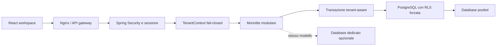

# Architettura multi-azienda e multi-tenant

## Stato e obiettivo

Questo documento definisce una proposta implementabile per evolvere il gestionale da installazione singola a prodotto multi-azienda e, successivamente, SaaS multi-tenant.

La proposta non dichiara che il sistema corrente sia multi-tenant. Nessuna policy RLS, membership tenant o separazione delle giacenze e oggi presente nel codice produttivo.

L'obiettivo e introdurre isolamento verificabile senza riscrivere il monolite modulare, senza duplicare il codice per cliente e senza confondere azienda giuridica, sede, magazzino e tenant.

## Evidenze dello stato corrente

- `company_settings` impone `id = 1`.
- `document_number_counters` e identificato solo da tipo ed esercizio.
- username, codici prodotto, partner e ordini sono globalmente univoci.
- `products` contiene quantita fisica e riservata.
- sessioni, audit e idempotenza non conservano un tenant.
- repository e report possono interrogare l'intero dataset.
- non esiste un meccanismo database che impedisca letture cross-tenant.

L'aggiunta isolata di una colonna `tenant_id` non sarebbe sufficiente.

## Terminologia

| Concetto | Responsabilita | Esempio |
| --- | --- | --- |
| Tenant | Confine contrattuale, di sicurezza, quota e fatturazione SaaS | Cliente che sottoscrive il servizio |
| Legal entity | Azienda giuridica che vende ed emette documenti | Societa o ditta individuale |
| Site | Sede fisica o operativa | Negozio di Napoli |
| Warehouse | Luogo logico che possiede giacenze e riserve | Magazzino principale |
| Membership | Relazione tra identita utente e tenant | Utente amministratore del tenant |
| Platform role | Privilegio operativo della piattaforma | Supporto tecnico con accesso break-glass |
| Tenant role | Permessi dentro un solo tenant | Owner, admin, dipendente, cliente |

Un tenant puo contenere piu legal entity. Una legal entity puo avere piu sedi. Una sede puo usare uno o piu magazzini.

## Decisione sintetica

La modalita standard usa:

- una applicazione Spring Boot;
- un database PostgreSQL;
- uno schema condiviso;
- `tenant_id` obbligatorio su ogni dato tenant-owned;
- contesto tenant derivato dalla sessione;
- filtri espliciti nei repository;
- foreign key composte;
- PostgreSQL Row-Level Security;
- test di isolamento applicativi e database.

La modalita dedicata usa lo stesso codice e lo stesso schema, ma assegna a un singolo tenant un deployment e un database separati.

Non viene adottato uno schema PostgreSQL per tenant.

## Vista architetturale



Il `TenantContext` non sostituisce Spring Security. Estende l'identita autenticata con tenant, membership e permessi correnti.

## Modello di identita e accesso

### Identita globale

`user_accounts` resta globale e rappresenta la persona o credenziale. Lo username continua inizialmente a essere univoco globalmente per evitare ambiguita nel login corrente.

Evoluzione prevista:

- `tenants`;
- `tenant_memberships`;
- `tenant_membership_roles` o ruoli tenant configurabili in una fase successiva;
- `auth_sessions.tenant_id`;
- `auth_sessions.membership_id`;
- versione membership o security stamp per invalidare sessioni dopo revoca.

Una membership contiene almeno:

- tenant;
- account;
- ruolo tenant;
- stato `INVITED`, `ACTIVE`, `SUSPENDED` o `REVOKED`;
- data creazione e attivazione;
- attore che ha invitato o modificato;
- versione di sicurezza.

La coppia `(tenant_id, user_account_id)` e univoca.

### Selezione tenant

Flusso previsto:

1. autenticazione dell'identita globale;
2. caricamento delle sole membership attive;
3. selezione automatica se ne esiste una sola;
4. scelta esplicita se ne esistono piu di una;
5. emissione o rotazione della sessione con tenant selezionato;
6. verifica membership a ogni autenticazione della richiesta.

Il cambio tenant ruota il token. Non cambia il tenant dentro una sessione gia emessa.

Un eventuale `X-Tenant-Id` non e fonte di autorizzazione. Puo essere usato soltanto durante una selezione autenticata e deve essere verificato contro le membership.

### Ruoli piattaforma e ruoli tenant

I privilegi piattaforma devono restare separati dai ruoli cliente:

- `PLATFORM_ADMIN` gestisce provisioning, salute e supporto;
- `TENANT_OWNER` governa il singolo tenant;
- `TENANT_ADMIN`, `EMPLOYEE` e `CUSTOMER` operano nel tenant.

L'attuale `SUPER_ADMIN` verra migrato a `TENANT_OWNER` del tenant predefinito. Non diventa automaticamente amministratore di piattaforma.

L'accesso del supporto ai dati cliente deve essere disabilitato per default. Un futuro accesso break-glass richiede motivazione, durata limitata, approvazione e audit non modificabile.

## Modello dati target

### Entita principali

| Tabella concettuale | Scopo | Chiave o vincolo principale |
| --- | --- | --- |
| `tenants` | Cliente contrattuale | `id UUID`, `slug` univoco |
| `tenant_memberships` | Accesso account al tenant | unique `(tenant_id, user_account_id)` |
| `legal_entities` | Aziende giuridiche | unique `(tenant_id, code)` |
| `sites` | Sedi operative | unique `(tenant_id, code)` |
| `warehouses` | Magazzini | unique `(tenant_id, code)` |
| `inventory_balances` | Stock per prodotto e magazzino | PK `(tenant_id, warehouse_id, product_id)` |
| `company_settings` | Configurazione per legal entity | unique `(tenant_id, legal_entity_id)` |
| `document_number_counters` | Progressivi per azienda e sezionale | PK tenant, legal entity, tipo, esercizio, serie |

### Dati globali

Restano globali soltanto:

- identita utente;
- configurazione tecnica della piattaforma;
- cataloghi statici realmente condivisi e privi di dati cliente;
- metadati di provisioning strettamente necessari.

Tutto cio che deriva dall'attivita di un cliente e tenant-owned.

### Dati tenant-owned

Devono ricevere `tenant_id` almeno:

- prodotti;
- anagrafiche;
- ordini, righe, pagamenti, transazioni e resi;
- movimenti, saldi e riserve di magazzino;
- documenti e contatori;
- configurazione aziendale;
- audit;
- idempotenza;
- sessioni selezionate;
- report materializzati o job export futuri.

Login attempt puo restare globale per identita e IP prima della selezione tenant. Gli eventi successivi al login includono il tenant.

### Identificativi e foreign key

Il tenant usa UUID non enumerabile. Gli identificativi tecnici esistenti possono restare `bigint`, ma ogni tabella tenant-owned espone anche unique `(tenant_id, id)`.

Le relazioni usano foreign key composte:

```text
order_items (tenant_id, order_id)
    -> customer_orders (tenant_id, id)

inventory_balances (tenant_id, product_id)
    -> products (tenant_id, id)
```

Questa regola impedisce a una riga del tenant A di riferire un record del tenant B anche in presenza di un bug applicativo.

Le unicita business diventano tenant-scoped:

- `(tenant_id, product_code)`;
- `(tenant_id, partner_code)`;
- `(tenant_id, order_code)`;
- `(tenant_id, idempotency_actor, operation, key)`;
- `(tenant_id, legal_entity_id, document_type, fiscal_year, series, sequence_number)`.

Gli indici delle query operative iniziano normalmente con `tenant_id`.

## Magazzini e giacenze

La quantita non puo restare sul prodotto quando esistono piu magazzini.

Il modello target separa:

- `products`: anagrafica commerciale del tenant;
- `warehouses`: luogo di stock;
- `inventory_balances`: fisico, riservato, disponibile e versione;
- `stock_movements`: ledger immutabile con magazzino origine o destinazione;
- `stock_transfers`: workflow futuro per trasferimenti tra magazzini.

Un ordine indica legal entity, sede di vendita e magazzino di evasione. La conferma riserva nello stesso magazzino; l'evasione scarica quel saldo; un reso ricevuto reintegra nel magazzino esplicitamente scelto.

Un trasferimento non modifica due saldi in chiamate separate. Deve essere una transazione unica con ordine di lock deterministico sui magazzini.

## Aziende e documenti

`CompanySettings` diventa configurazione per legal entity e perde il vincolo singleton globale.

Ogni documento conserva:

- tenant;
- legal entity emittente;
- serie o sezionale;
- snapshot emittente;
- snapshot cliente;
- aliquote e importi;
- riferimenti ordine.

Il contatore documento e isolato per tenant, legal entity, tipo, esercizio e serie. La numerazione resta atomica, ma non costituisce fatturazione elettronica certificata.

## Isolamento applicativo

### TenantContext

Il backend introduce un valore immutabile per richiesta contenente:

- tenant ID;
- membership ID;
- account ID;
- ruolo e permessi tenant;
- eventuale legal entity e warehouse selezionati quando richiesti.

Il contesto nasce solo dopo la validazione della sessione e viene eliminato a fine richiesta. Thread pool, scheduler e processi asincroni devono riceverlo esplicitamente: non devono affidarsi a un `ThreadLocal` ereditato implicitamente.

Una richiesta operativa senza tenant valido restituisce un errore autorizzativo stabile e non esegue query tenant-owned.

### Service e repository

Ogni metodo applicativo tenant-owned riceve un `TenantId` tipizzato o usa un port che lo richiede. I repository espongono metodi come:

```text
findByTenantIdAndCode(tenantId, code)
findAllByTenantId(tenantId, specification, pageable)
```

Non viene considerato sufficiente un filtro Hibernate globale, perche query native, job e nuovi repository potrebbero ometterlo.

Il tenant non viene letto dai DTO di prodotto, ordine, magazzino o documento. Il backend lo deriva dal contesto autenticato.

## Isolamento PostgreSQL

### Ruoli database

Sono previsti ruoli distinti:

- ruolo migration owner usato da Flyway;
- ruolo runtime applicativo non proprietario;
- ruolo read-only operativo, se necessario;
- ruolo amministrativo controllato per recovery.

Il runtime non usa `BYPASSRLS`.

### Row-Level Security

Ogni tabella tenant-owned applica concettualmente:

```sql
alter table products enable row level security;
alter table products force row level security;

create policy products_tenant_isolation on products
using (tenant_id = current_setting('app.tenant_id', true)::uuid)
with check (tenant_id = current_setting('app.tenant_id', true)::uuid);
```

All'inizio di ogni transazione tenant-aware il backend usa l'equivalente parametrizzato di:

```sql
select set_config('app.tenant_id', :tenantId, true);
```

Il terzo parametro `true` limita il valore alla transazione. Questo evita che una connessione restituita al pool conservi il tenant precedente.

Le tabelle usano `FORCE ROW LEVEL SECURITY` per includere il proprietario quando applicabile. Il ruolo runtime resta comunque separato dal proprietario.

Le operazioni prive di `app.tenant_id` non vedono e non scrivono righe tenant-owned. Migrazioni, provisioning e recovery usano ruoli e procedure separate, non un bypass nascosto nei normali endpoint.

### Difesa multilivello

RLS e l'ultima barriera, non l'unica:

- autorizzazione Spring Security;
- membership attiva;
- repository tenant-scoped;
- foreign key composte;
- RLS forzata;
- audit con tenant;
- test di isolamento.

## API e frontend

Gli endpoint business restano `/api/products`, `/api/orders` e simili. Il tenant attivo proviene dalla sessione, evitando di ripetere `/tenants/{id}` e riducendo il rischio di IDOR.

Endpoint dedicati previsti:

- `GET /api/auth/tenants`;
- `POST /api/auth/select-tenant`;
- `GET /api/context`;
- API piattaforma sotto `/api/platform/tenants`, protette separatamente.

Il frontend aggiunge:

- selettore tenant solo per utenti con piu membership;
- selettore legal entity o magazzino solo nei flussi che lo richiedono;
- reset dello stato e delle cache a ogni cambio tenant;
- tenant visibile nella shell per evitare operazioni nel contesto sbagliato;
- nessun tenant persistito come autorizzazione autonoma nel browser.

## Job, audit, idempotenza e osservabilita

Ogni job tenant-owned memorizza il tenant nel payload persistito e avvia una transazione con contesto esplicito.

Audit:

- `tenant_id` obbligatorio per eventi cliente;
- legal entity e warehouse quando rilevanti;
- eventi piattaforma separati;
- accessi break-glass sempre ad alta severita.

Idempotenza:

- chiave confinata per tenant, attore e operazione;
- risposta salvata mai riusata tra tenant.

Metriche:

- nessun `tenant_id` grezzo come label Prometheus ad alta cardinalita;
- metriche aggregate per piano o classe dimensionale;
- dettagli tenant nei log strutturati e nei sistemi audit con accesso controllato.

## Backup, restore ed eliminazione

Modalita pooled:

- backup fisico protegge l'intero database;
- export e restore del singolo tenant richiedono strumenti logici dedicati;
- cancellazione tenant usa workflow con sospensione, retention e purge verificabile;
- ogni export deve includere dipendenze e checksum.

Modalita dedicata:

- backup e restore possono essere confinati al database cliente;
- RPO e RTO possono essere personalizzati.

La scelta di retention, portabilita e cancellazione verra allineata alla proposta GDPR dello Step 34. Nessuna cancellazione definitiva deve essere implementata prima di quella decisione.

## Strategia di migrazione

La migrazione usa expand/contract e non modifica le migrazioni Flyway esistenti.

### Fase A - Inventario e test di sicurezza

- classificare ogni tabella come globale o tenant-owned;
- inventariare repository, query native, export, job e cache;
- creare una matrice di accesso cross-tenant;
- introdurre test PostgreSQL reali, non soltanto H2.

Uscita: nessun punto di accesso ai dati resta senza proprietario e test previsto.

### Fase B - Fondazione tenant

- aggiungere `tenants` e `tenant_memberships`;
- creare un tenant predefinito per l'installazione corrente;
- collegare tutti gli account esistenti tramite membership;
- mantenere temporaneamente il login corrente.

Uscita: ogni account esistente appartiene al tenant predefinito.

### Fase C - Espansione schema

- aggiungere `tenant_id` nullable alle tabelle tenant-owned;
- backfill deterministico verso il tenant predefinito;
- aggiungere indici concorrenti dove supportato;
- verificare conteggi, checksum e record orfani;
- rendere `tenant_id` non nullo solo dopo la verifica.

Uscita: tutte le righe operative hanno tenant e nessun dato e perso.

### Fase D - Contesto applicativo

- estendere sessioni e utente autenticato;
- introdurre `TenantContext`;
- rendere servizi e repository tenant-aware;
- vietare tenant da payload business;
- aggiungere test IDOR e cross-tenant.

Uscita: il codice applicativo non esegue query operative prive di tenant.

### Fase E - Vincoli e RLS

- sostituire unicita globali con vincoli tenant-scoped;
- introdurre foreign key composte;
- separare ruolo Flyway e ruolo runtime;
- attivare e forzare RLS tabella per tabella;
- testare assenza contesto, tenant errato e connessioni riutilizzate.

Uscita: un bug di filtro applicativo non consente accesso cross-tenant.

### Fase F - Multi-azienda

- introdurre legal entity;
- migrare `CompanySettings`;
- estendere documenti e contatori;
- preservare gli snapshot storici;
- aggiungere autorizzazioni per azienda quando richiesto.

Uscita: numerazioni e configurazioni sono indipendenti per legal entity.

### Fase G - Sedi e magazzini

- introdurre sedi, magazzini e saldi;
- migrare quantita e riserve dal prodotto al magazzino predefinito;
- aggiornare ordini, movimenti, resi e report;
- aggiungere trasferimenti atomici.

Uscita: la somma saldi coincide con lo stock precedente e i flussi usano un magazzino esplicito.

### Fase H - Esperienza e operations SaaS

- selezione tenant e contesto visibile nel frontend;
- provisioning idempotente;
- quote, sospensione e lifecycle tenant;
- export, recovery e osservabilita tenant-aware;
- test di carico e noisy-neighbor.

Uscita: onboarding e gestione operativa sono ripetibili e documentati.

## Rollback

- ogni fase ha una migrazione separata;
- durante expand/contract le vecchie colonne restano leggibili finche il nuovo percorso e verificato;
- il tenant predefinito mantiene compatibilita con installazioni singole;
- RLS viene attivata per modulo dopo il confronto dei risultati;
- il rollback applicativo non rimuove colonne o dati appena introdotti;
- le operazioni distruttive avvengono soltanto in una release successiva e dopo backup verificato.

Un feature flag puo mantenere nascosta la selezione multi-tenant, ma non deve disabilitare i controlli di isolamento una volta che dati di tenant diversi condividono il database.

## Strategia di test

### Test obbligatori

- tenant A non elenca dati di B;
- tenant A non legge, modifica o cancella ID e codici di B;
- tenant A non collega una propria riga a un record di B;
- richiesta senza contesto fallisce chiusa;
- header o payload tenant falsificato non cambia contesto;
- membership sospesa o revocata invalida l'accesso;
- cambio tenant ruota il token e svuota cache/stato frontend;
- connessione del pool riutilizzata non conserva il tenant precedente;
- query native, report ed export rispettano RLS;
- idempotency key uguale in tenant diversi non collide;
- numerazioni sono indipendenti per azienda;
- riserve, evasione, resi e trasferimenti restano atomici per magazzino;
- audit registra il tenant corretto senza esporlo in label metriche ad alta cardinalita;
- backup, export, purge e restore rispettano il perimetro previsto.

### Ambienti

- unit test per value object e policy;
- integrazione PostgreSQL reale per RLS e vincoli composti;
- test Spring Security per membership e permessi;
- Playwright con almeno due tenant e due utenti;
- test concorrenza su numerazioni e saldi;
- prod-like pooled e, prima della vendita dedicata, prod-like con database separato.

H2 non e sufficiente per certificare RLS.

## Osservabilita e supporto

Log e audit includono tenant in forma controllata. I log non contengono dati personali o segreti.

Alert iniziali:

- errori RLS o contesto tenant mancante;
- tentativi cross-tenant;
- provisioning fallito;
- membership revocate ancora attive;
- job senza tenant;
- squilibrio saldi magazzino;
- consumo anomalo per classe di tenant.

Il supporto non usa account cliente condivisi. Ogni accesso assistito deve essere nominativo e auditato.

## Prestazioni e capacita

- indici con `tenant_id` come prefisso per filtri dominanti;
- paginazione obbligatoria;
- nessun tenant nelle label Prometheus;
- quote su export e job;
- analisi `EXPLAIN` sui tenant grandi;
- partizionamento di audit e movimenti valutato soltanto con volumi reali;
- passaggio a database dedicato per isolamento o carico, senza cambiare il modello dominio.

## Rischi principali

| Rischio | Mitigazione prevista |
| --- | --- |
| Query dimentica il tenant | Repository scoped, RLS forzata e test negativi |
| Connessione conserva contesto precedente | `set_config(..., true)` nella transazione e test sul pool |
| Foreign key cross-tenant | Vincoli composti con `tenant_id` |
| Ruolo database aggira RLS | Runtime non owner e senza `BYPASSRLS` |
| Super admin globale troppo potente | Ruoli piattaforma separati e break-glass auditato |
| Migrazione perde o duplica dati | Expand/contract, tenant predefinito, riconciliazione e backup |
| Noisy neighbor | Quote, limiti, metriche aggregate e tier dedicato |
| Restore singolo tenant incompleto | Export logico con dipendenze e drill dedicato |
| Complessita prematura | Implementazione per fasi con gate di uscita |

## Criteri di accettazione della futura implementazione

La funzionalita multi-tenant potra essere dichiarata pronta solo quando:

- nessuna tabella tenant-owned e priva di `tenant_id` non nullo;
- tutte le foreign key tra dati tenant-owned impediscono riferimenti cross-tenant;
- il ruolo runtime e soggetto a RLS forzata;
- nessun endpoint business accetta il tenant come autorita dal client;
- test PostgreSQL e browser dimostrano isolamento con almeno due tenant;
- sessioni e membership vengono revocate correttamente;
- audit, idempotenza, report, export e job sono tenant-aware;
- backup e recovery sono stati provati nella modalita offerta;
- il tenant predefinito preserva l'installazione singola;
- documentazione GDPR, onboarding e runbook sono approvati.

## Decisioni rinviate

Restano intenzionalmente separate:

- base giuridica, retention, data export e diritto alla cancellazione;
- fatturazione elettronica e conservazione documentale;
- piani commerciali, billing SaaS e quote;
- branding e white-label;
- identity provider OIDC;
- ruoli tenant personalizzabili;
- scelta dell'orchestratore e del secret manager.

Questi punti dipendono dagli Step 34 e 35 e da requisiti commerciali reali.
