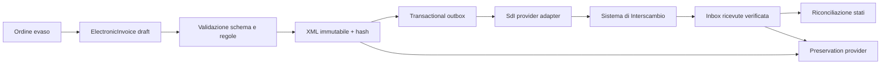

# Privacy, retention, conservazione e fatturazione elettronica

## Stato e limite della proposta

Questo documento definisce un'architettura target. Non implementa le funzionalita descritte e non costituisce attestazione di conformita legale, GDPR, fiscale o di conservazione.

Il gestionale corrente:

- gestisce dati personali operativi senza un workflow completo per i diritti;
- conserva audit e backup tecnici, ma non applica una matrice generale di retention;
- produce documenti esplicitamente simulati;
- non genera il tracciato XML fiscale;
- non comunica con il Sistema di Interscambio;
- non acquisisce ricevute SdI;
- non effettua conservazione elettronica a norma.

Prima di un utilizzo reale, titolare del trattamento, consulente privacy, commercialista, responsabile della conservazione e fornitori scelti devono approvare processi, ruoli e configurazioni applicabili al caso concreto.

## Fonti ufficiali di riferimento

Fonti consultate il 2026-07-25:

- Regolamento (UE) 2016/679: https://eur-lex.europa.eu/legal-content/IT/TXT/?uri=CELEX:32016R0679
- Guida EDPB per piccole imprese: https://www.edpb.europa.eu/sme_en
- Doveri del titolare e del responsabile, Garante Privacy: https://www.garanteprivacy.it/web/guest/home/docweb/-/docweb-display/docweb/8981258
- FAQ sul registro dei trattamenti, Garante Privacy: https://www.garanteprivacy.it/home/faq/registro-delle-attivita-di-trattamento
- Gestione documentale e conservazione, AgID: https://www.agid.gov.it/it/ambiti-intervento/gestione-documentale
- Linee Guida sul documento informatico, AgID: https://www.agid.gov.it/sites/default/files/repository_files/linee_guida_sul_documento_informatico.pdf
- FAQ sul documento informatico, AgID: https://www.agid.gov.it/it/domande-frequenti/documento-informatico
- Guida alla fatturazione elettronica, Agenzia delle Entrate: https://www1.agenziaentrate.gov.it/web_app_entrate/fatturazione_elettronica.html
- Specifiche tecniche del formato FatturaPA pubblicate dal Sistema di Interscambio: https://www.fatturapa.gov.it/export/documenti/Specifiche_tecniche_del_formato_FatturaPA_V1.3.1.pdf

Le fonti devono essere ricontrollate prima di ogni rilascio. Versioni di schema, regole tecniche, obblighi e interpretazioni possono cambiare.

## Separazione dei problemi

| Area | Obiettivo | Non equivale a |
| --- | --- | --- |
| Privacy | Trattare dati personali secondo finalita, necessita, diritti e rischio | Cancellare ogni dato su richiesta senza verifiche |
| Retention | Applicare tempi e destinazioni approvati alle classi di dati | Tenere tutto per sempre |
| Backup | Ripristinare il servizio dopo perdita o incidente | Archivio storico consultabile o conservazione a norma |
| Audit | Ricostruire operazioni e decisioni | Conservare copie complete dei dati personali |
| Gestione documentale | Governare originali, metadati, versioni e fascicoli | Salvare un PDF in una cartella |
| Conservazione | Preservare documenti ed evidenze secondo processo regolato | Backup o object storage ordinario |
| Fatturazione elettronica | Generare XML, trasmettere, ricevere esiti e riconciliare | Produrre il PDF di un documento simulato |

## Ruoli organizzativi

Il software non puo assegnare autonomamente i ruoli giuridici. La configurazione contrattuale deve stabilire almeno:

- titolare del trattamento;
- eventuali contitolari;
- responsabile del trattamento;
- sub-responsabili e fornitori infrastrutturali;
- responsabile privacy o DPO, quando richiesto;
- responsabile della conservazione, quando richiesto;
- responsabile fiscale e intermediario;
- amministratori e operatori autorizzati.

Nel servizio SaaS, il cliente sara normalmente il titolare per i dati della propria attivita e il fornitore del gestionale potra agire come responsabile. Questa e una configurazione attesa, non una classificazione automatica: contratto, finalita effettive e istruzioni prevalgono.

I ruoli legali non vengono mappati direttamente sui ruoli applicativi `SUPER_ADMIN`, `ADMIN`, `EMPLOYEE` e `CUSTOMER`. Il sistema usera permessi granulari e deleghe esplicite.

## Inventario e classificazione dati

Prima dell'implementazione ogni campo, allegato, log, export e backup deve essere censito.

Classi iniziali:

| Classe | Esempi attuali | Trattamento target |
| --- | --- | --- |
| Identita account | username, ruolo, stato | minimizzazione, accesso amministrativo, retention di sicurezza |
| Autenticazione | hash password, sessioni, tentativi login | mai esportare password o token; cleanup configurato |
| Contatti e anagrafiche | nome, email, telefono, indirizzo, dati fiscali | finalita e base giuridica approvate, diritti e retention |
| Dati commerciali | ordini, righe, resi, pagamenti gestionali | conservazione coerente con contratto e obblighi |
| Documenti | snapshot cliente/azienda, importi, allegati futuri | immutabilita controllata e accesso ristretto |
| Audit e sicurezza | attore, request ID, IP ove raccolto, evento | pseudonimizzazione quando possibile e retention limitata |
| Telemetria | log, metriche, trace | nessun payload o identificatore non necessario |
| Export e file temporanei | CSV, XLSX, PDF | scadenza breve, accesso controllato, cancellazione verificata |

Dati particolari, biometrici, sanitari, giudiziari e profilazione non fanno parte del perimetro previsto. La raccolta deve fallire o richiedere un'estensione formalmente approvata.

## Registro dei trattamenti e accountability

Il registro dei trattamenti resta un artefatto governato dall'organizzazione. Il gestionale puo fornire un inventario tecnico, ma non deve generare una falsa dichiarazione di conformita.

Per ogni trattamento devono essere approvati almeno:

- finalita;
- base giuridica;
- categorie di interessati e dati;
- destinatari e sub-responsabili;
- trasferimenti internazionali;
- tempi o criteri di conservazione;
- misure di sicurezza;
- owner organizzativo;
- data di approvazione e revisione;
- necessita di DPIA.

Le modifiche al registro devono essere versionate e riconciliate con il comportamento reale del sistema.

## Privacy by design e minimizzazione

Regole target:

- campi obbligatori soltanto se necessari alla finalita;
- niente consenso usato come base predefinita per ogni trattamento;
- accesso per tenant, funzione e necessita operativa;
- ricerca e report senza esposizione di campi non richiesti;
- dati sensibili esclusi da log, metriche, URL e messaggi errore;
- valori personali pseudonimizzati negli ambienti non produttivi;
- export protetti, a scadenza e non pubblici;
- feature nuove sottoposte a privacy review;
- impostazioni piu restrittive abilitate per default.

## Richieste degli interessati

Il modulo futuro `privacy` introdurra un workflow per:

- accesso;
- rettifica;
- cancellazione;
- limitazione;
- opposizione;
- portabilita quando applicabile.

Stati proposti:

```text
RECEIVED -> IDENTITY_VERIFICATION -> ASSESSMENT -> APPROVED
                                           |-> PARTIALLY_APPROVED
                                           |-> REJECTED
APPROVED -> EXECUTING -> QUALITY_REVIEW -> COMPLETED
```

Ogni pratica deve contenere:

- identificativo non predicibile;
- tenant e interessato;
- tipo di richiesta;
- canale e data ricezione;
- verifica identita separata dai documenti operativi;
- decisione, motivazione e approvatore;
- fonti dati interrogate;
- azioni eseguite e controlli;
- scadenza operativa configurabile;
- comunicazioni ed evidenze;
- audit privo di copie superflue dei dati richiesti.

Nessuna API pubblica deve consentire una cancellazione a cascata immediata. La verifica di identita, gli obblighi concorrenti e i legal hold vengono valutati prima dell'esecuzione.

## Motore di retention

Le durate non vengono codificate nelle entita di dominio. Una policy versionata identifica:

- tenant;
- classe dati;
- finalita e base giuridica approvate;
- evento iniziale del conteggio;
- durata attiva;
- eventuale durata di archivio;
- azione finale: cancellazione, anonimizzazione o trasferimento;
- eccezioni e legal hold;
- owner e approvatori;
- versione e periodo di validita.

Il motore opera in questo ordine:

1. selezione di candidati per policy;
2. esclusione dei record coperti da legal hold;
3. dry-run con conteggi, motivazioni e impatti;
4. approvazione a quattro occhi per classi critiche;
5. esecuzione idempotente a lotti;
6. verifica dei riferimenti e dell'isolamento tenant;
7. registrazione del risultato senza copiare il dato eliminato;
8. metriche e alert su errori o arretrati.

Il dry-run non deve includere dati personali nei log. Query arbitrarie o SQL fornito dall'utente non fanno parte del modello.

## Legal hold

Un legal hold sospende cancellazione e anonimizzazione per uno scopo documentato.

Campi minimi:

- tenant;
- ambito o selettore controllato;
- motivo;
- autorita richiedente o procedimento;
- creatore e approvatore distinti;
- data inizio, revisione e scadenza;
- stato;
- audit delle modifiche.

Un hold non estende automaticamente l'accesso ai dati. Accesso, esportazione e revoca restano permessi separati.

## Cancellazione, anonimizzazione e backup

La cancellazione deve essere definita per aggregato:

- dati non piu necessari: cancellazione fisica quando possibile;
- dati che devono conservare valore statistico: anonimizzazione irreversibile verificata;
- dati soggetti a obbligo o contenzioso: restrizione e segregazione;
- audit: minimizzazione dell'identita, non cancellazione indiscriminata della prova;
- documenti fiscali: nessuna riscrittura distruttiva senza decisione giuridica e fiscale.

I backup immutabili non vengono riscritti per ogni richiesta. Devono avere retention limitata, accesso eccezionale e cifratura. Dopo un restore, un erasure ledger minimale e privo dei dati cancellati riapplica cancellazioni, anonimizzazioni e restrizioni maturate dopo il backup.

Il restore drill deve verificare anche questa riapplicazione prima della riapertura del servizio.

## Incidenti e data breach

Il runbook privacy deve collegarsi alla gestione incidenti:

1. rilevazione e contenimento;
2. preservazione delle evidenze;
3. classificazione di dati, interessati e tenant coinvolti;
4. valutazione di probabilita e gravita;
5. decisione documentata sulla notifica;
6. comunicazioni approvate;
7. rimedio e verifica di efficacia.

Il sistema registra timeline, decisioni e owner, ma non decide automaticamente se notificare. Le scadenze normative vengono calcolate e segnalate senza sostituire la valutazione del titolare e del DPO.

## Modello dati privacy target

Tutte le tabelle sono tenant-scoped secondo ADR 0005.

```text
privacy_processing_activities
privacy_subject_requests
privacy_subject_request_events
retention_policies
retention_executions
legal_holds
erasure_tombstones
privacy_incidents
privacy_incident_events
```

Requisiti:

- chiavi e foreign key composte con `tenant_id`;
- optimistic locking sulle pratiche;
- eventi append-only;
- payload personali separati dai metadati di workflow;
- cifratura applicativa per allegati di verifica identita;
- scadenza breve degli allegati;
- nessuna copia di password, token o segreti.

## Gestione documentale e conservazione

Il repository applicativo e il sistema di conservazione sono componenti diversi.

Oggetti applicativi:

- documento originale immutabile;
- versione del formato;
- hash crittografico;
- metadati obbligatori;
- relazione con ordine, soggetti e documenti collegati;
- stato di gestione;
- policy applicabile.

Oggetti di conservazione:

- riferimento al pacchetto di versamento;
- esito di presa in carico;
- identificativo del conservatore;
- hash ed evidenze;
- eventuali rapporti o pacchetti restituiti;
- stato e data delle verifiche periodiche.

Il provider di conservazione e raggiunto tramite `PreservationProviderPort`. L'adapter non puo marcare un documento come conservato senza una evidenza verificata e persistita.

Manuale di conservazione, piano di conservazione, nomine, deleghe e accordi di servizio sono artefatti organizzativi. Il software puo collegarli e versionarli, ma non puo approvarli.

## Fatturazione elettronica target

### Separazione dal documento simulato

`FiscalDocument` resta un documento gestionale simulato. Il futuro `ElectronicInvoice` e un aggregato distinto e non riusa il disclaimer come prova fiscale.

La migrazione non converte automaticamente documenti storici simulati in fatture elettroniche.

### Componenti



### Stati

Il modello separa:

- stato di preparazione: `DRAFT`, `VALIDATED`, `READY`;
- stato trasmissione: `QUEUED`, `SUBMITTED`, `TRANSMISSION_FAILED`;
- esito SdI: `PENDING`, `ACCEPTED`, `REJECTED`;
- recapito: `DELIVERED`, `UNDELIVERABLE`, `NOT_APPLICABLE`;
- conservazione: `NOT_SUBMITTED`, `SUBMITTED`, `PRESERVED`, `PRESERVATION_FAILED`.

`ACCEPTED` e `DELIVERED` non sono sinonimi. Uno scarto non viene presentato come fattura emessa. Ogni stato deriva da un evento verificato e non da un semplice click frontend.

### Payload e versioni

Per ogni trasmissione:

- XML originale immutabile;
- versione schema e versione regole;
- nome file;
- hash;
- timestamp UTC;
- tenant e azienda emittente;
- idempotency key;
- identificativo provider e SdI quando disponibile;
- ricevute originali;
- stato di validazione;
- audit della trasformazione.

Il PDF e una rappresentazione di cortesia. Non sostituisce il file XML rilevante per il processo.

### Validazione

La pipeline usa:

- XSD ufficiale versionato;
- validazione semantica interna;
- golden file anonimizzati;
- test di compatibilita per ogni versione;
- blocco invio se la configurazione fiscale non e approvata;
- feature flag per azienda e ambiente;
- sandbox provider prima del go-live.

La firma o sigillatura non viene imposta indiscriminatamente: il requisito dipende dal canale, dal destinatario, dal formato e dalle regole vigenti.

### Trasmissione e ricezione

La trasmissione usa una outbox transazionale. Il worker:

- seleziona eventi con lock;
- invia in modo idempotente;
- applica retry con backoff e limite;
- distingue errore temporaneo, definitivo e risultato incerto;
- non genera un nuovo numero per un semplice retry;
- apre una riconciliazione manuale quando l'esito e ambiguo.

Le ricevute entrano da una inbox autenticata:

- verifica origine e integrita;
- deduplica tramite identificativo e hash;
- conserva il payload originale;
- aggiorna lo stato con transizione ammessa;
- produce audit e notifica operativa;
- non accetta callback priva di tenant o correlazione.

### Correzioni

- documento `DRAFT`: modificabile;
- XML `READY`: una modifica crea una nuova versione prima dell'invio;
- documento `REJECTED`: correzione e nuovo tentativo secondo procedura approvata;
- documento accettato: nessuna riscrittura; rettifiche tramite documento previsto e processo fiscale approvato.

## Modello dati fatturazione target

```text
electronic_invoices
electronic_invoice_versions
electronic_invoice_transmissions
electronic_invoice_receipts
electronic_invoice_outbox
electronic_invoice_inbox
preservation_submissions
preservation_evidence
```

Vincoli essenziali:

- unicita per tenant, azienda, tipo, esercizio e numero;
- hash univoco del payload nel relativo contesto;
- idempotenza per operazione e tenant;
- ricevuta immutabile;
- transizioni di stato controllate;
- foreign key tenant-safe;
- nessun hard delete dopo trasmissione.

## API, frontend e autorizzazioni

Permessi separati:

- `VIEW_PRIVACY_CASES`;
- `MANAGE_PRIVACY_CASES`;
- `APPROVE_ERASURE`;
- `MANAGE_LEGAL_HOLDS`;
- `VIEW_ELECTRONIC_INVOICES`;
- `PREPARE_ELECTRONIC_INVOICES`;
- `SUBMIT_ELECTRONIC_INVOICES`;
- `RECONCILE_ELECTRONIC_INVOICES`;
- `MANAGE_PRESERVATION`.

Operazioni sensibili richiedono ri-autenticazione e, per cancellazioni, hold e invii, approvazione a quattro occhi configurabile.

Il frontend mostra chiaramente:

- documento simulato oppure elettronico;
- stato reale e fonte dello stato;
- ultimo esito e ricevuta;
- operazioni disponibili;
- avvertenze bloccanti;
- request ID e riferimenti di riconciliazione.

## Sicurezza

- TLS end-to-end;
- credenziali provider e certificati in secret manager;
- cifratura storage e backup;
- chiavi separate per ambiente e rotazione provata;
- allegati non serviti direttamente da path pubblico;
- antivirus e content-type validation sugli allegati;
- allowlist dei callback provider;
- firma o verifica crittografica delle callback quando supportata;
- log senza XML, dati fiscali completi, token o allegati;
- accesso break-glass temporaneo, motivato e auditable;
- export con scadenza e download autenticato;
- segregazione tra operatori, approvatori e amministratori tecnici.

## Osservabilita

Metriche a cardinalita limitata:

- pratiche privacy aperte e oltre SLA;
- retention dry-run, esecuzioni, errori e arretrato;
- legal hold in scadenza;
- trasmissioni per stato;
- tempo di attesa ricevute;
- scarti per categoria finita;
- riconciliazioni manuali aperte;
- conservazioni in attesa o fallite.

Non usare tenant, codice fiscale, numero fattura o identificativo SdI come label Prometheus.

## Migrazione

La migrazione usa expand/contract e feature flag.

### Fase A - Governance

- inventario reale dei dati;
- registro dei trattamenti;
- ruoli e contratti;
- matrice retention;
- DPIA quando necessaria;
- selezione provider e conservatore;
- approvazione professionale.

Gate: nessun codice di cancellazione o invio fiscale prima dell'approvazione.

### Fase B - Fondazioni privacy

- classificazione dati;
- workflow richieste;
- legal hold;
- permessi e re-autenticazione;
- audit minimizzato.

Gate: test tenant, autorizzazioni e accesso dati.

### Fase C - Retention in osservazione

- policy versionate;
- dry-run senza cancellazione;
- report impatto;
- confronto con owner.

Gate: almeno due cicli approvati senza divergenze.

### Fase D - Retention controllata

- esecuzione su classi a basso rischio;
- quattro occhi;
- erasure ledger;
- restore con riapplicazione.

Gate: restore drill e riconciliazione completi.

### Fase E - Fatturazione in shadow mode

- aggregato e XML versionato;
- validazione locale;
- outbox e adapter sandbox;
- nessun invio produttivo.

Gate: golden file, test provider e riconciliazione.

### Fase F - Pilot

- azienda pilota;
- volumi limitati;
- doppio controllo professionale;
- monitoraggio scarti e ricevute;
- conservazione verificata.

Gate: firma di accettazione degli owner e procedura di rollback.

### Fase G - Go-live

- feature flag per tenant/azienda;
- runbook e on-call;
- provider SLA;
- export e strategia di uscita;
- controlli periodici sulle specifiche.

## Rollback

Privacy:

- disabilitare nuove esecuzioni retention;
- non annullare cancellazioni gia completate;
- conservare risultati minimali e riconciliare i lotti;
- mantenere legal hold e restrizioni.

Fatturazione:

- fermare nuovi invii;
- completare o riconciliare richieste gia trasmesse;
- non riportare a bozza documenti accettati;
- preservare XML, ricevute e hash;
- passare al canale alternativo approvato.

## Test obbligatori

### Privacy e retention

- tenant A non accede a pratiche, hold o policy di B;
- permessi e quattro occhi;
- verifica identita separata;
- accesso, rettifica, limitazione, cancellazione e rigetto motivato;
- legal hold prevale sulla retention;
- dry-run non modifica dati;
- retry retention non duplica effetti;
- anonimizzazione irreversibile verificata;
- audit non conserva il dato cancellato;
- restore riapplica erasure ledger e restrizioni;
- export non include campi non necessari;
- log e metriche privi di dati personali.

### Fatturazione e conservazione

- XSD e regole per ogni versione supportata;
- golden XML anonimizzati;
- importi, arrotondamenti e codici controllati;
- idempotenza del comando di invio;
- retry non genera nuovo numero;
- callback non autenticata rifiutata;
- ricevuta duplicata ignorata in modo idempotente;
- scarto non marcato come emissione;
- accettazione distinta dal recapito;
- payload e ricevute immutabili;
- evidenza del conservatore obbligatoria per stato `PRESERVED`;
- test sandbox provider;
- export completo prima del cambio provider;
- isolamento cross-tenant su XML, ricevute e conservazione.

## Criteri per dichiarare una funzionalita disponibile

Privacy workflow:

- registro e matrice retention approvati;
- ruoli contrattuali definiti;
- test positivi e negativi;
- runbook incidenti e diritti;
- audit e restore verificati;
- approvazione professionale documentata.

Fatturazione elettronica:

- provider e canale contrattualizzati;
- XML conforme alla versione vigente;
- sandbox e pilot superati;
- ricevute e riconciliazione operative;
- conservazione attivata e verificata;
- procedure fiscali approvate;
- nessuna etichetta "simulato" rimossa prima del go-live.

Conservazione:

- responsabile e manuale definiti quando richiesti;
- piano e metadati approvati;
- evidenze recuperabili;
- export e uscita dal provider testati;
- verifiche periodiche pianificate.

## Decisioni rinviate

- provider SdI;
- conservatore;
- canale diretto o intermediato;
- firma e certificati applicabili;
- matrice definitiva di retention;
- necessita e perimetro DPIA;
- localizzazione e trasferimenti internazionali;
- tempi di risposta interni;
- formato di portabilita;
- gestione di piu paesi e regimi fiscali;
- livelli commerciali e responsabilita contrattuali.

Queste decisioni richiedono dati reali, mercato target, fornitori e validazione professionale. Non devono essere sostituite da placeholder presentati come requisiti.
